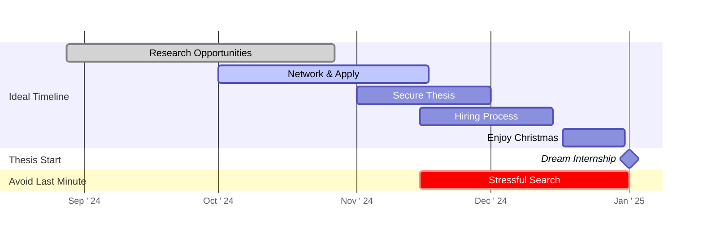

  

    <h1 style="color: #333; margin-bottom: 10px; font-size: 2.5em;">How to Find Your Master's Thesis</h1>
    
Strategies for Success - Lars Oberhofer

  

  

    Press Space for next page <carbon:arrow-right class="inline"/>
  

---

# Me: Lars Oberhofer

## About Me

<v-clicks>

- B.Sc. Electrical Engineering / UTwente 🇳🇱
* **HCID** 
- 👉 / Paris-Saclay University (former EIT node) 2022-23 🇫🇷
- 👉 / Aalto University 2023-24 🇫🇮

</v-clicks>

---
layout: image-right
image: https://cover.sli.dev
---

# Channels for Securing a Thesis

<v-clicks>

- 🔗 LinkedIn
- 💼 JobTeaser
- 📰 University CS Newsletter 'Tuutti'
- 🤝 Networking Events (Aalto Thesis Day, etc.)
- 📌 University posters other announcements
- <carbon-collaborate /> Hackathons etc. 
- 🎓 Contact with researchers
- 👥 Contacts

</v-clicks>

 
 

> "Your network is your net worth." - Tim Sanders

---
layout: center
---

# Preparing for Networking Events

<v-clicks>

- ✅ Research companies beforehand
- 🗣️ Be proactive in conversations
- 🚫 Don't expect ready-made plans
- 📞 Follow up after the event

</v-clicks>

---

# Common Pitfalls to Avoid

<v-clicks>

1. ⏰ Waiting too long to start
2. 🐢 Being passive in networking situations
3. 📞 Not following up after initial contact

</v-clicks>

---
layout: full
---

# Timeline: Start Early!

---

# My Personal Experience 

<v-clicks>

- September started researching companies Helsinki
- October: Attended 'Aalto-EIT Masters Matchmaking Event'
- Engaged with companies, exchanged contacts
- Next day: Sent detailed follow-ups, proposed initial plans
- Found interesting research at ABB
- End of October: Secured thesis topic
- November: Signed contract
- Result: Stress-free Christmas holidays

</v-clicks>

---
layout: center
---
# My Master Thesis

<v-clicks>

  
 

 
 </v-clicks>

---
layout: center
---
# My Master Thesis

 

    
 

---
layout: center
---
# My Master Thesis

  

---
layout: center
---
# My Master Thesis

  

---
layout: center
---

# Thesis Search Myths

<v-clicks>

<ThesisMyths />

</v-clicks>

---

# How to Start!

<ul class="checklist">
<v-clicks>

- <input type="checkbox" /> Update CV and LinkedIn profile
- <input type="checkbox" /> Research potential companies and topics
- <input type="checkbox" /> Attend at least 2 networking events
- <input type="checkbox" /> Reach out to researchers or professors in your area of interest
- <input type="checkbox" /> Engage with 5 companies about thesis opportunities

</v-clicks></ul>

<Tweet id="1137843064498733058" scale="0.65" />

---
layout: center
class: text-center
---

# Questions?

Feel free to reach out on Telegram:
[@larrsoo](https://t.me/larrsoo)

  
    Thank you for your attention! <carbon-send class="inline ml-2"/>
  

---
layout: end
---

# Good luck with your thesis search!

